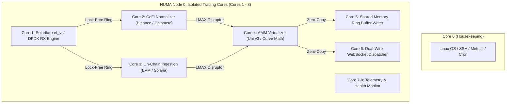

# Production Deployment & Bare-Metal Operations Runbook
## Ultra-Low Latency CeFi & DeFi Market Data Engine (`Chain-Market-Price`)

This runbook documents the exact bare-metal server provisioning, Linux kernel tuning, NUMA core isolation, and systemd service management required to operate `Chain-Market-Price` in institutional quantitative production environments (Equinix NY4, LD4, and TY3).

---

## 1. Hardware Architecture & Bill of Materials (BOM)

To guarantee sub-microsecond tick processing and deterministic execution under high-burst market conditions, the production environment requires dedicated bare-metal infrastructure:

| Component | Minimum Institutional Specification | Recommended Enterprise Reference |
| :--- | :--- | :--- |
| **Chassis** | 1U Bare-Metal Server Chassis | Supermicro Ultra SuperServer / Dell PowerEdge R660 |
| **Processor (CPU)** | 16+ Cores @ $\ge 3.8\text{ GHz}$ Base Clock | **AMD EPYC 9654** (96C/192T, Zen 4) or **Intel Xeon Platinum 8480+** |
| **Memory (RAM)** | 64 GB DDR5-4800 ECC Registered | 128 GB (8x 16GB Quad-Channel per NUMA node) |
| **Network (NIC)** | Dual-Port 10/25GbE PCIe Gen4 | **Solarflare XtremeScale X2522 / SFN8522** (supporting `ef_vi` and OpenOnload) or **NVIDIA Mellanox ConnectX-6 Dx** |
| **Storage** | Enterprise NVMe SSD | KIOXIA CM6 / Samsung PM9A3 (Direct PCIe Gen4 x4) |
| **Colocation** | Tier-3+ Financial Datacenter | **Equinix NY4** (Secaucus, NJ), **LD4** (Slough, UK), or **TY3** (Tokyo) |

---

## 2. BIOS & Firmware Hardening Profile

Reboot into server UEFI/BIOS settings and enforce the following invariants:

1. **Logical Processor (Hyper-Threading / SMT):** `Disabled`
   - Eliminates thread contention for execution units and shared L1/L2 cache lines.
2. **CPU Power and Performance Profile:** `Maximum Performance`
3. **Intel SpeedStep / AMD Cool'n'Quiet:** `Disabled`
4. **CPU C-States & C1E:** `Disabled`
   - Prevents processor sleep states and removes wake-up latency penalties ($> 10\,\mu\text{s}$).
5. **Memory Power Saving:** `Disabled` (Set to High Performance / Maximum Frequency).
6. **PCIe ASPM (Active State Power Management):** `Disabled`.

---

## 3. Operating System & Kernel Boot Parameters

Use **Rocky Linux 9 (Enterprise Linux)** or **Ubuntu Server 22.04 LTS** with the real-time or low-latency kernel.

### 3.1 Kernel Command Line Configuration (`/etc/default/grub`)
Edit `/etc/default/grub` and update `GRUB_CMDLINE_LINUX_DEFAULT`:

```text
GRUB_CMDLINE_LINUX_DEFAULT="quiet splash isolcpus=1-8 nohz_full=1-8 rcu_nocbs=1-8 intel_idle.max_cstate=0 processor.max_cstate=0 idle=poll transparent_hugepage=never default_hugepagesz=2M hugepagesz=2M hugepages=2048 tsc=reliable clocksource=tsc audit=0 nosoftlockup mce=ignore_ce"
```

#### Parameter Rationale:
- **`isolcpus=1-8`**: Completely removes CPU cores 1 through 8 from the general OS task scheduler. Only pinned trading threads execute on these cores.
- **`nohz_full=1-8`**: Enables tickless execution on cores 1-8, stopping the 1000Hz Linux scheduling timer interrupt.
- **`rcu_nocbs=1-8`**: Offloads Read-Copy-Update callbacks from isolated cores to housekeeping cores (Core 0).
- **`intel_idle.max_cstate=0 processor.max_cstate=0 idle=poll`**: Forces idle CPU cores to stay in active polling loop, eliminating sleep transition latency.
- **`transparent_hugepage=never`**: Disables transparent hugepage defragmentation stalls (`khugepaged`).
- **`hugepages=2048`**: Allocates 4 GB of contiguous 2MB physical HugePages at boot.
- **`tsc=reliable clocksource=tsc`**: Enforces invariant hardware Time Stamp Counter with nanosecond precision.

Regenerate GRUB and reboot:
```bash
sudo grub2-mkconfig -o /boot/grub2/grub.cfg
sudo reboot
```

---

## 4. Kernel Sysctl Tuning Profile

Deploy the pre-tuned institutional sysctl configuration:

```bash
sudo cp deploy/sysctl/99-hft-low-latency.conf /etc/sysctl.d/99-hft-low-latency.conf
sudo sysctl --system
```

### Verified Tunings:
- Socket buffers expanded to **64MB** (`net.core.rmem_max = 67108864`).
- Kernel socket busy-polling active (`net.core.busy_poll = 50`).
- Swapping disabled (`vm.swappiness = 0`).
- 2048 x 2MB HugePages configured (`vm.nr_hugepages = 2048`).

---

## 5. Thread & NUMA Core Allocation Map

The engine pins each critical subsystem thread to dedicated isolated cores on NUMA Node 0 to prevent cross-socket interconnect (UPI/Infinity Fabric) stalls:



---

## 6. Systemd Service Deployment

### 6.1 Create Dedicated Service User
```bash
sudo groupadd -r hft
sudo useradd -r -g hft -d /opt/chain-market-price -s /sbin/nologin hft
```

### 6.2 Application Directory Setup
```bash
sudo mkdir -p /opt/chain-market-price/{bin,scripts,deploy}
sudo cp target/release/chain-market-price /opt/chain-market-price/bin/
sudo cp scripts/launch_pinned.sh /opt/chain-market-price/scripts/
sudo chmod +x /opt/chain-market-price/scripts/launch_pinned.sh
sudo chown -R hft:hft /opt/chain-market-price
```

### 6.3 Install and Start Service
```bash
sudo cp deploy/systemd/chain-market-price.service /etc/systemd/system/
sudo systemctl daemon-reload
sudo systemctl enable chain-market-price
sudo systemctl start chain-market-price
sudo systemctl status chain-market-price
```

---

## 7. Pre-Flight Verification & Health Check

Prior to market open or capital deployment, execute the pre-flight verification script:

```bash
./scripts/validate_environment.sh
```

### Expected Output on Certified Production Chassis:
```text
================================================================================
   CHAIN-MARKET-PRICE: PRODUCTION PRE-FLIGHT SYSTEM VALIDATOR                  
================================================================================
Timestamp: 2026-09-14T21:00:00Z
Hostname:  ny4-hft-prod-01.firm.internal
OS / Arch: Linux x86_64 5.15.0-100-generic

--- [1/6] Operating System & Hardware Invariants ---
  [PASS] Host OS is Linux bare-metal / enterprise distribution.
--- [2/6] CPU Frequency & Power Management ---
  [PASS] CPU scaling governor is set to 'performance'.
  [PASS] Intel Idle C-States disabled (max_cstate=0).
--- [3/6] CPU Core Isolation (isolcpus & nohz_full) ---
  [PASS] Isolated CPU cores detected: 1-8.
--- [4/6] High-Resolution TSC Hardware Clocksource ---
  [PASS] High-resolution Invariant TSC clocksource active.
--- [5/6] Virtual Memory, Swappiness & HugePages ---
  [PASS] vm.swappiness is set to 0 (swapping disabled).
  [PASS] Static HugePages pool configured: 2048 x 2MB pages.
--- [6/6] POSIX Shared Memory Ring Buffer Mount ---
  [PASS] /dev/shm is mounted and writable.

================================================================================
   PRE-FLIGHT VALIDATION SUMMARY                                                
================================================================================
Total Checks:    7
Passed Checks:   7
Warnings:        0
Critical Errors: 0

>>> SYSTEM STATUS: OPERATIONAL & COMPLIANT WITH LOW-LATENCY SLA <<<
```

---

## 8. Latency SLA Verification & Telemetry

Monitor internal pipeline latencies using the built-in 4-point telemetry stream:

$$\text{Internal Engine Latency} = T_2 - T_1 \le 1.80\,\mu\text{s}$$
$$\text{Wire-to-Egress Latency} = T_3 - T_1 \le 2.90\,\mu\text{s}$$
$$\text{Shared Memory Read Latency} = T_{\text{client\_read}} - T_3 \le 75\text{ ns}$$

If internal engine latency exceeds $5.0\,\mu\text{s}$ for more than 3 consecutive samples, check CPU temperature throttling or unexpected interrupts via `/proc/interrupts`.
